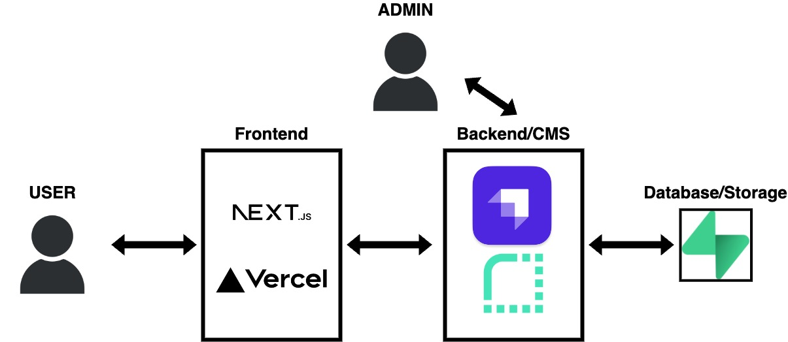

# The Giving Heart

**Description**: [insert description later]

**Point of Contact**:
|Name| Email|
| :--- | :--- |
|Dan Nguyen| danthedevnguyen@gmail.com |

# Getting Started

First, run the development server:

```bash
yarn dev
```

Check if code is deployable:
```bash
yarn build
```

Open [http://localhost:3000](http://localhost:3000) with your browser to see the result.

# Enviornment Variables

```
NEXT_PUBLIC_STRAPI_API_TOKEN=""
NEXT_PUBLIC_PAGE_LIMIT=6
NEXT_PUBLIC_STRAPI_FORM_SUBMISSION_TOKEN=""

# local development:
NEXT_PUBLIC_STRAPI_API_URL=http://localhost:1337

# hosted:
# NEXT_PUBLIC_STRAPI_API_URL=""
NEXT_PUBLIC_MAPBOX_ACCESS_TOKEN="pk.eyJ1IjoidGhlZ2l2aW5naGVhcnQiLCJhIjoiY2xwNWl3bm50MWVudzJqbzRzMHQ4cHRpdyJ9.hd8bhxh4uUXhe1xA1X9tCA"
```

# Tech Stack



- Framework - [Next.js 13](https://nextjs.org/)
- Langauge - [TypeScript](https://www.typescriptlang.org/docs/handbook/intro.html)
- CMS - [Strapi](https://docs.strapi.io/)
- Database - [Supabase](https://supabase.com/docs)
- Frontend Deployment - [Vercel](https://vercel.com/docs)
- CMS Deployment - [Render](https://render.com/docs)
- Styling - [Tailwind CSS](https://tailwindcss.com/docs/installation)
